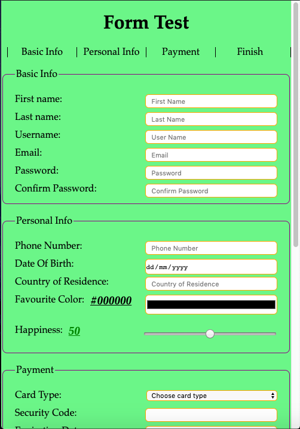
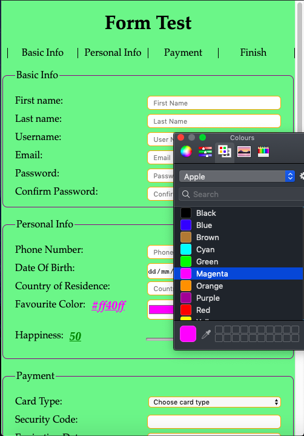
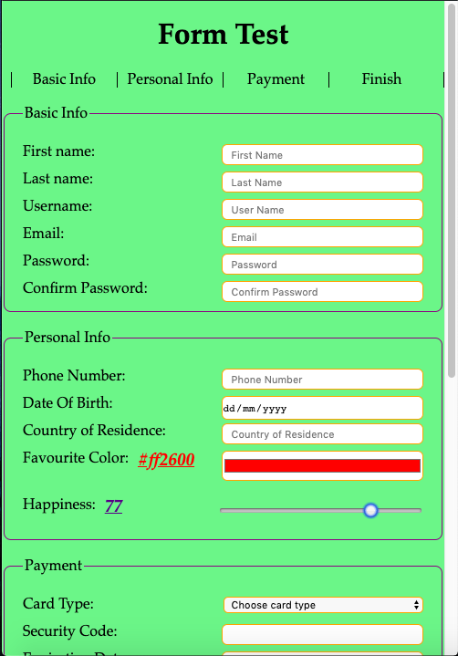

# Form Test

## How To Open
> 1. Open the project's download folde
> 2. Right click on the file named _index.html_
> 3. Choose the _open with_ option
> 4. Open the page in a browser of your choice

## How To Use
> 1. Interact with form

## Requirements
> 1. This project requires a browser to run
> 2. The browser must have JavaScript available and enabled

## Extra Info
> 1. This was made as one of the optional projects for the w3c and Microsoft's *HTML5 Coding Essentials and Best Practices** course, the fourth in their *Front End Web Developer Professional Certificate*

## Preview

